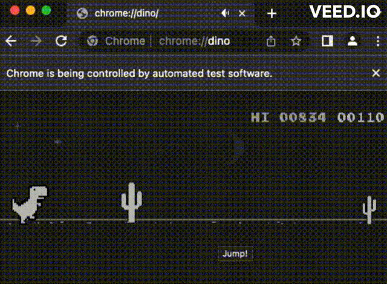

# Dino Q-Learning AI

## Description

This project builds a game bot for Chrome Dino Game using q-learning algorithm.

<p align="center">
  
</p>

## Performance

After training for 10,000 episodes (16 hours on a 2017 Macbook Pro), with the best model chosen from the validation process, the bot can get a stable 100+ score in most of games. The highest score this model got during the test was 834. And the average score it got in 20 games was 158.1 during validation process.

<p align="center">
  
</p>

## Environment

- Device: 2017 Macbook Pro
- Python: 3.7.7
- Dependency: see [requirements.txt](requirements.txt)

## Instructions

Install dependencies:

```bash
pip install -r requirements.txt
```

Train and save models:

```python
python app.py train
```

Validate trained models:

```python
python app.py validate
```

Test with trained model:

```python
python app.py test
```

## Some thoughts

- Frame rate plays an important role in this project and it varies on different devices. The delay between `frame` and `next_frame` (state returned from the environment) should be short enough so that the model can get a real-time feedback.
- Some tutorials suggest using a sequence of frames as input. In my experiment it didn't work out, possiblly due to the unstable frame rate. (Samples of training data would have different frame rate from each other and the frame rate in the test process.) Lack of training time might be another reason because it needed a larger neural network.
- At the end of the training process, the performance was still at a rising trend. Maybe the model can get a better performance given more training time.

## Possible improvements

- Train for more episodes. (Maybe 100,000)
- Remove unnecessary debug code (logs, display frame) to increase frame rate.
- Train and save model in another process, so that it won't interrupt the sample process.
- Save the model in time when the bot makes a new record in training process.
- Try use more advanced variants of q-learning algorithm.

## References

- https://github.com/Paperspace/DinoRunTutorial
- https://github.com/leeivan1007/DinoRunTutorial
- https://github.com/DataSenseiAryan/T-RexDinoRunner-GAME-AI-BOT
